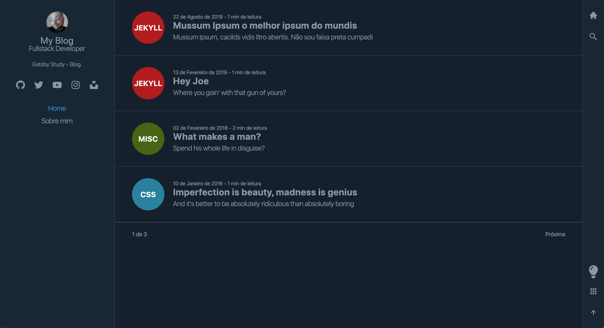
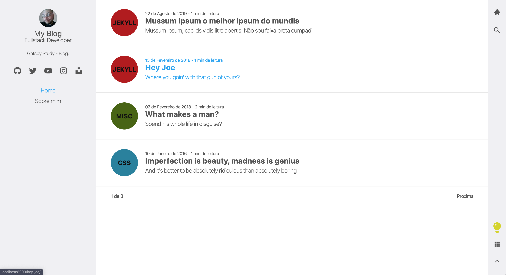
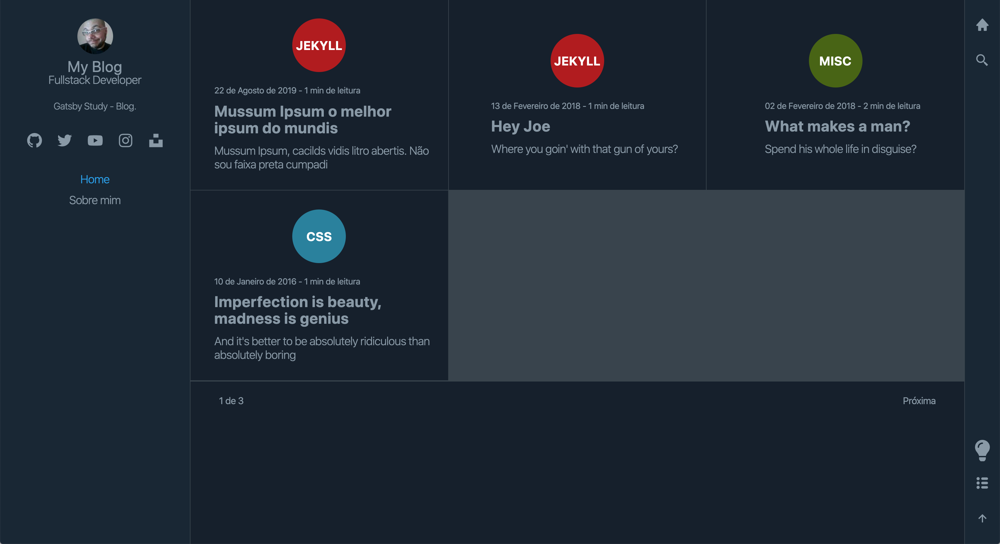
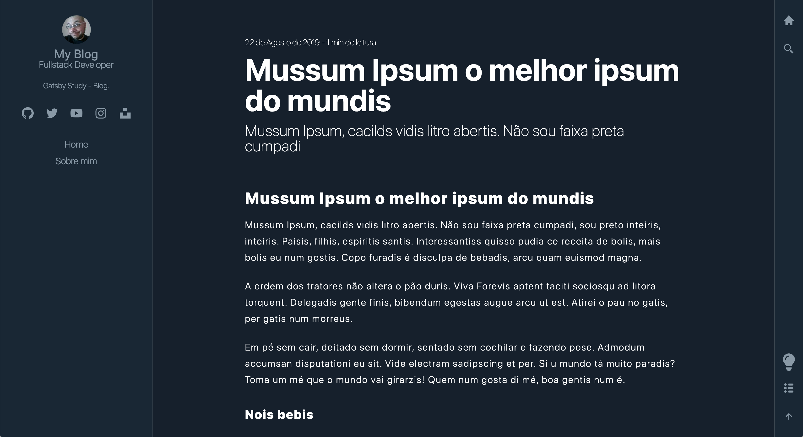
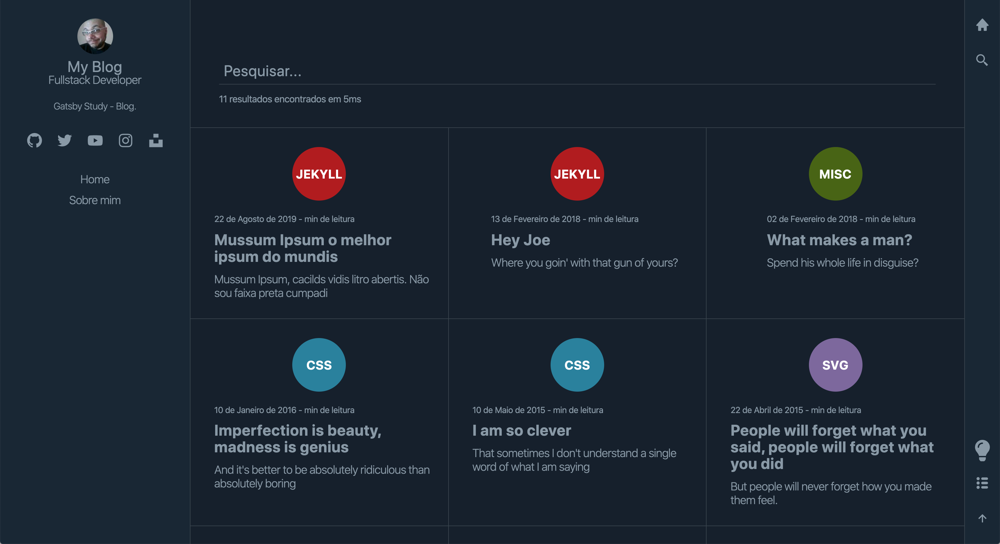

<!-- Info Header -->
<table>
  <tr>
    <td>
      
    </td>
    <td>
      <h3>
        Projeto criado no Curso Gatsby: Crie um site PWA com React, GraphQL e Netlify CMS
      </h3>
      
Site Institucional com sistema de blog, criado em Gatsby, usando algolia para as buscas e pequenas consultas em GraphQL.

      

        
        
      

      <p">
        <a href="#telas-do-sistema">Telas do Sistema</a>&nbsp;&nbsp;&nbsp;|&nbsp;&nbsp;&nbsp;
        <a href="#descrição">Descrição</a>
      

    </td>
  </tr>
</table>

#### Telas do Sistema

    

    

    

    

    

---

#### Descrição

Projeto criado no Curso Gatsby: Crie um site PWA com React, GraphQL e Netlify CMS.
Site Institucional com sistema de blog, criado em Gatsby, usando algolia para as buscas, pequenas consultas em GraphQL, tema Light / Dark e visualização em lista e grid.
